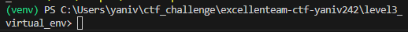

## level 3
same drill as level 2, with the /level3 endpoint

but we need to run the script from a GCE (google cloud env) VM
i choose a debian linux, but it doesnt really matter.
the fact we use a venv help us install packages more easily instead of installing
pip on the machine itself.
google provide an online ssh terminal, which you can easily upload files and interact with the machine.

command to run venv

```bash
python3 -m venv venv
```
the command has created a venv folder
it will install/load

next we need to active it using the active script

```bash
.\venv\Scripts\Activate.ps1
```

now our env is active we can pip install

## problem found
during this exerice, i noticed i started getting 504 errors from the server.
the first thing that i though of, that it was part of the level, and the server "lowers" our batch size
as we make more requests.
so i adopted the following approach trying to bypass it:

```python

async def adaptive_fetch(session, base_url, start, initial_batch_size, scale_back_factor):
    batch_size = initial_batch_size
   # timeout = 10  # Starting timeout in seconds
    while True:
        data, success = await fetch_data(session, base_url, start, start + batch_size, timeout)
        if data:
            yield data
            if success:
                start += batch_size
               # timeout = max(5, timeout - 1)  # Decrease timeout after a success
            else:
                batch_size = max(100, int(batch_size * scale_back_factor))  # Scale back batch size on failure
               # timeout += 5  # Increase timeout on failure
        else:
            if batch_size > 100:
            #or timeout < 30:
                batch_size = max(100, int(batch_size * scale_back_factor))
               # timeout = min(30, timeout + 5)  # Adjust timeout up to a maximum
            else:
                print("Stopping after minimum batch size and +++maximum timeout reached.")
                break
```

basicly we just keep fetching, and lowering the batch side by a scale back factor (started with 0.75)
but even this approach failed, and we have reached the threshould (batch <100) , which will take too long to find the flag
at this point i contact Gil which wrote the drill and the servers, and it was indeed a server overload.
so he gave me an alternative ip address to the level 3 endpoint, it turns out the servers were just overloaded with the rest of the fellows
trying to complete level 2.
so the above code wasnt even necc, but i still included it, even in the next levels, cus why not.

