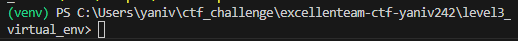

command to run venv

```bash
python3 -m venv venv
```
the command has created a venv folder
it will install/load

next we need to active it using the active script

```bash
.\venv\Scripts\Activate.ps1
```

now our env is active we can pip install

